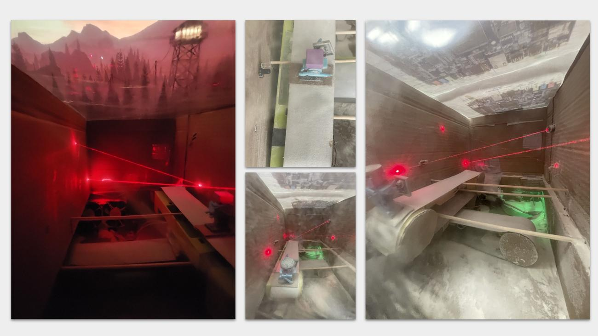
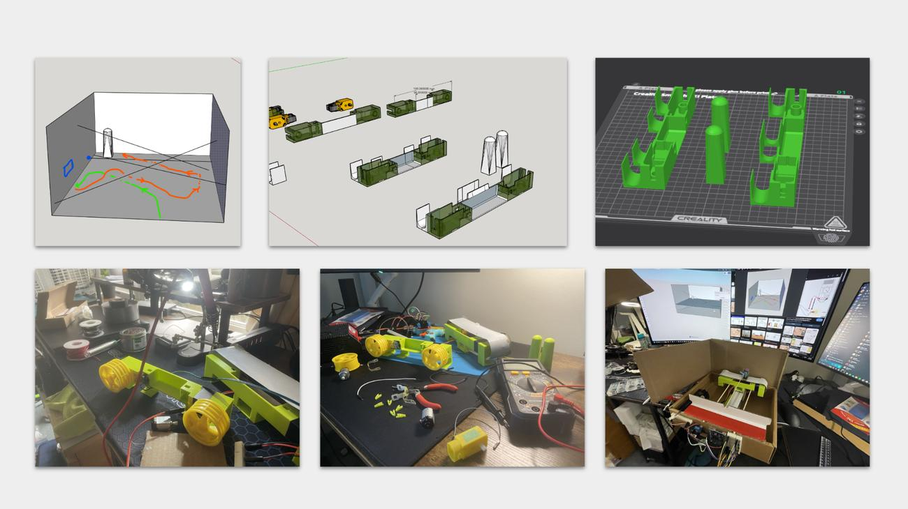
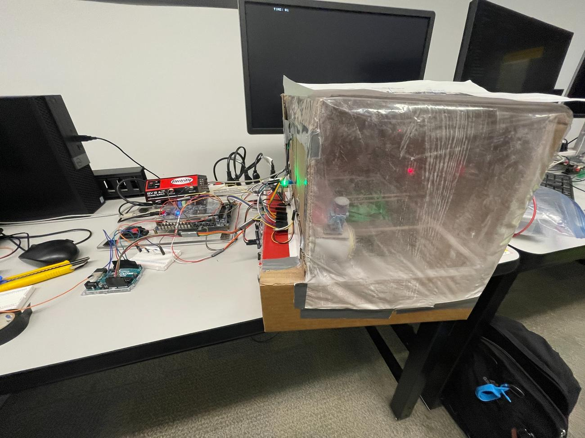

# The Museum Break-In
## Physical Laser Obstacle Course Game (DE1-SoC / Nios V)

A physical museum security game built around the **DE1-SoC FPGA board** and its **Nios V / RISC-V processor**. A LEGO minifigure is moved through a 2D laser obstacle course using two independently controlled conveyor axes. The player has to avoid breaking the laser beams, reach a checkpoint that disables the final barrier, and retrieve an "expensive GPU" from the pedestal before the countdown timer expires.

The DE1-SoC is the main controller for the project. It handles game state, timing, sensor events, motor control, and VGA feedback. Arduino Uno boards are used as supporting hardware interfaces, including analog-to-digital conversion for the photoresistor sensors.

By: **Abby Lui & Christopher Lee**

  

---

## Project Demo

**Full demo:** [Chris & Abby - Final Project Demo (Google Drive)](https://drive.google.com/file/d/1x_qFAAnGF3lfjsZumd14p-Xw97Y5nBXw/view?usp=drive_link)

---

## Repository Structure

This public repository focuses on the **design, architecture, development process, and final prototype**:

- `README.md` - complete project walkthrough.
- `assets/title-collage.jpg` - final project and enclosure overview.
- `assets/physical-movement-collage.jpg` - mechanical design and conveyor development.
- `assets/hardware-bridge.jpg` - final physical integration between the enclosure and control electronics.
- `assets/3d-printing-timelapse.mp4` - compressed source video of the custom conveyor parts being printed.

> **Academic Integrity & Licensing**  
> To comply with academic integrity and plagiarism policies at the University of Toronto, the C source code for this course project will **not** be published in this repository.

---

## Game Overview

The player controls a LEGO minifigure suspended from a two-axis conveyor system inside a laser-filled museum enclosure.

The objective is to:

1. Move through the obstacle course using the DE1-SoC pushbuttons.
2. Avoid interrupting any of the laser/photoresistor security beams.
3. Reach the checkpoint, which disables the blocking checkpoint laser.
4. Continue through the final section of the course.
5. Trigger the artifact sensor and retrieve the GPU before the timer expires.

A broken security beam or a timeout immediately transitions the project into a **game-over state**, stops player movement, and changes the VGA output. Reaching the final pedestal after clearing the checkpoint produces the successful completion state.

---

## High-Level Architecture

At a system level, the project is split into three layers:

1. **Physical game hardware** - enclosure, lasers, sensors, conveyor motors, fans, wiring, and pedestal.
2. **DE1-SoC control system** - central game state, interrupts, countdown timing, motor control, and PWM.
3. **VGA feedback** - visual state and status output for the player.

  

A key design choice was keeping the **actual game logic on the DE1-SoC**. The Arduino interface converts analog photoresistor readings into signals the FPGA system can use, but movement, timing, game-state decisions, interrupt handling, and output behaviour remain on the Nios V side.

---

## 1. Physical Movement System

The original movement idea was much simpler: attach the player to a stick and move it through the course manually. During development, that evolved into a much more ambitious **two-axis motorized conveyor system**.

Two TT DC motors independently control the X and Y movement axes. Custom mounts and conveyor parts were designed and 3D printed so the player could be positioned across the 2D playfield rather than following a fixed track.

  

This mechanical system became one of the defining parts of the project because it connected the player's physical movement directly to the board's real-time control system.

### 3D-Printed Conveyor Parts

A large part of the movement system depended on custom printed pieces designed around the TT motors and the physical dimensions of the enclosure.

  

The animation above is taken directly from the original 3D-printing timelapse used during the build.

---

## 2. Laser Security System

The obstacle system uses **four laser emitters paired with four photoresistors**. Each photoresistor watches a laser beam, creating a physical security boundary across the course.

Because the photoresistors are analog sensors, an Arduino Uno is used as an **analog-to-digital conversion interface**. The converted sensor states are then passed to the DE1-SoC, where the actual game logic decides whether a beam has been interrupted.

When a beam is broken:

- the sensor event is handled by the DE1-SoC,
- the game transitions to the failure state,
- player movement is stopped,
- the VGA output updates to reflect the failure.

This makes the laser hardware part of the actual game logic rather than just a visual effect.

---

## 3. Checkpoint and Artifact Progression

The game is intentionally multi-stage instead of being a single "reach the end" path.

The final design uses **two IR sensors**:

- **Checkpoint IR sensor** - detects when the player has reached the checkpoint and allows the blocking laser to be disabled.
- **Pedestal IR sensor** - detects the final artifact pickup and completion condition.

That gives the course a natural progression. The player first has to survive the laser maze, then unlock access to the final region, and finally reach the artifact pedestal before the timer runs out.

---

## 4. Interrupt-Driven Game Logic

Timing mattered throughout the project. The program needed to watch sensors, update the countdown, control the motors, and update the VGA without one task blocking another.

Rather than placing everything into one large polling loop, the system uses **interrupt-driven event handling** for the time-sensitive parts of the game.

| Event | Role in the game |
| --- | --- |
| Photoresistor / laser event | Detects a broken security beam and triggers failure |
| Checkpoint IR event | Advances the game and disables the checkpoint barrier |
| Pedestal IR event | Detects successful artifact pickup |
| Countdown timer | Maintains real-time game timing and triggers timeout |
| Motor PWM timer | Schedules motor enable/disable timing independently from the main game flow |

This structure keeps input handling and timing responsive even while the display and other logic are active.

---

## 5. Motor Control and Interrupt-Driven PWM

The DE1-SoC drives an **L298N motor driver**, which controls the two conveyor motors.

Directly switching a motor fully on or off was too abrupt for precise movement, so the motor speed was regulated using **pulse-width modulation (PWM)**. The PWM logic had to run on predictable timing; otherwise VGA work or other game logic could introduce delays and make movement inconsistent.

To solve that, motor PWM was implemented using a separate interval-timer interrupt. At the end of each PWM cycle, the motor-control logic checks the active movement keys and updates the direction and enable signals for the two motors.

This kept player movement responsive, reduced the motors to a usable speed, and separated movement timing from VGA rendering and higher-level game-state work.

---

## 6. VGA Feedback

The VGA display acts as the player's software-side view of the game.

It provides feedback for states such as:

- active gameplay,
- timer and status information,
- laser-triggered failure,
- timeout,
- successful artifact retrieval.

The project reused the low-level VGA techniques developed earlier in ECE243, but extended them into a complete physical-game interface where the screen reacts to events occurring inside the enclosure.

Several visual concepts were explored during brainstorming before the final presentation was settled, including different fail/success screens and background layouts.

---

## 7. Hardware

| Component | Purpose |
| --- | --- |
| DE1-SoC FPGA board | Main game controller running Nios V |
| 4 × laser emitters | Physical security beams |
| 4 × photoresistors | Laser interruption detection |
| 2 × IR sensors | Checkpoint and final pedestal detection |
| 2 × TT DC motors | X/Y conveyor movement |
| L298N motor driver | Motor direction and enable control |
| 2 × Arduino Uno | Supporting hardware interfaces, including sensor ADC |
| 3 × fans | Improve laser visibility inside the enclosure |
| 12 V / 12 A power supply | Power for the physical hardware |
| 10 kΩ resistors / voltage division | Signal conditioning between hardware levels |
| VGA display | Game-state and status feedback |

### DE1-SoC Inputs

- Four pushbuttons for X/Y movement.
- Converted photoresistor security signals.
- Checkpoint IR sensor.
- Pedestal IR sensor.
- Reset / control input.

### DE1-SoC Outputs

- Six motor-driver control signals.
- Checkpoint laser control.
- VGA output.

  

The wiring map shows how the DE1-SoC GPIO, motor driver, Arduino interfaces, sensors, lasers, fans, voltage conversion, and power rails were tied together in the physical build.

---

## 8. Building the Enclosure

The physical enclosure changed significantly as the project moved from planning to integration.

The laser paths were first modelled in 3D so there would be a valid route through the course. The conveyor mounts were then designed around the actual TT motors and printed to fit the required movement geometry.

As more hardware was installed, the enclosure gained:

- a back-access panel for maintenance,
- clear front/top covering for visibility,
- an internal pedestal and checkpoint,
- laser emitters and matching sensor locations,
- cable routing and power distribution,
- fans to make the beams more visible inside the enclosure.

  

This photo shows the final physical bridge between the course and its supporting electronics. The enclosure contains the moving game and sensors, while the DE1-SoC, Arduino interface, motor driver, power distribution, and supporting wiring sit alongside it.

The final prototype ended up being much more hardware-heavy than we originally expected, which made integration and debugging a major part of the project.

---

## 9. Testing, Debugging, and Iteration

This project made debugging very different from a normal software-only lab because a failure could come from several layers at once.

During integration, issues included:

- incorrect game logic,
- GPIO or wiring mistakes,
- loose cables,
- sensor alignment,
- physical wear on the moving parts,
- restricted access inside the enclosure,
- material interfering with sensors or gearboxes,
- laser/photoresistor misalignment causing immediate false triggers.

The first stage of development focused on testing sensors, motors, and the enclosure separately. The later stage was mostly about integrating those systems and finding the boundary between a software bug, an electrical problem, and a mechanical problem.

That integration process was one of the biggest lessons from the project. Once software is controlling a real physical system, debugging becomes a full-system engineering problem.

---

## Design Evolution

Not every feature stayed exactly as it was first proposed.

### What changed

- The early checkpoint concept used an ultrasonic sensor and manual trigger; the final design moved to an **IR-based checkpoint system**.
- The movement concept evolved from a simpler manual mechanism into a **fully motorized two-axis conveyor**.
- VGA feedback and final artifact pickup were completed for the demo.
- Background music and the planned audio alarm were part of the optional scope but were **not completed** in the final build.

The final project was the result of repeated scope and integration decisions rather than a one-shot implementation of the original proposal.

---

## Attribution

### Abby Lui

- Used the Arduino as an analog-to-digital interface for the photoresistors.
- Sent and received GPIO signals for the IR sensor, photoresistor interrupts, and laser activation.
- Implemented the IR, photoresistor, and timer interrupt handling.
- Implemented the main game-state logic for progress, laser failure, and timeout.
- Implemented the VGA display and LED indicators.

### Christopher Lee

- Retrieved movement input from the DE1-SoC keys.
- Configured GPIO control signals for the motor driver.
- Designed and integrated the custom interrupt-driven PWM motor-control system.
- Designed and 3D printed the physical conveyor parts.
- Assembled the physical components and managed the project wiring.

**Supervising TA:** Angela Yu

---

## Final Result

The Museum Break-In ended up combining **embedded software, FPGA I/O, real-time interrupts, motor control, sensors, 3D-printed mechanisms, physical fabrication, and VGA graphics** into one interactive system.

What began as a laser security game became a project where the difficult part was getting every layer to work together at the same time. That systems-integration challenge is also what made the project one of the most rewarding parts of ECE243.
